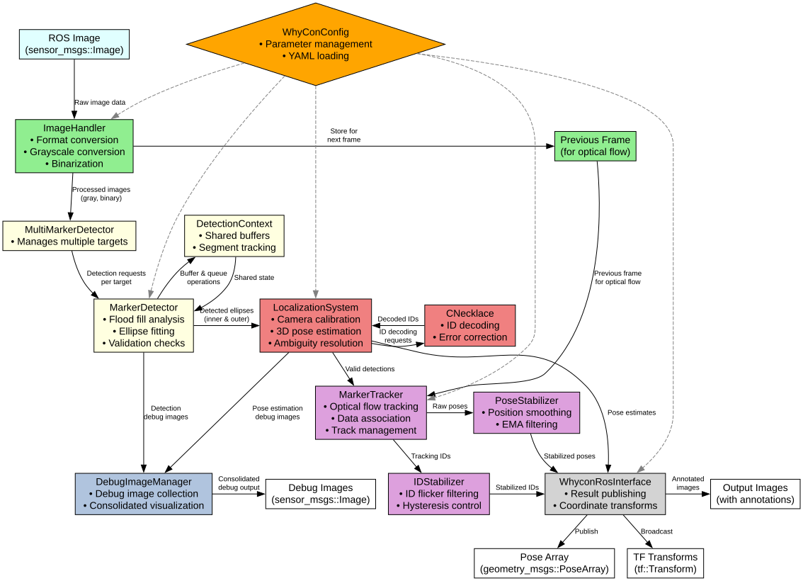

# WhyCon/WhyCode Localization ROS Package

## Overview

`whycode_vision` is a ROS2 package for detecting and localizing circular WhyCon/WhyCode markers and decoding embedded WhyCode IDs. It estimates the 3D pose of these markers relative to a camera.

## Features

* **Multi-Marker Detection**: Detects multiple circular black and white WhyCon markers simultaneously.
* **WhyCode Decoding**: Decodes WhyCode IDs embedded within the markers.
* **Pose Estimation**: Estimates the 6-DOF pose (position and orientation) of each detected marker.
* **ROS2 Deployment Options**: Run as a standalone node or as a composable component.
* **ID Tracking and Stabilization**: Reduces ID flicker using a hysteresis-based ID stabilizer and maintains tracks over time with lightweight 2D tracking.
* **Modular Build Options**: Enable or disable triangulation and benchmarks using CMake options.

## Demo Videos

### Moving camera and detection


### Four-marker triangulation demo


## WhyCon Marker Detection Range

The maximum detection range of WhyCon markers depends on both the **physical size of the marker** and the **camera resolution**. Below are reference values measured in typical warehouse lighting with a RealSense camera:

| Marker Outer Diameter (m) | Marker Inner Diameter (m) | Resolution | Max Detection Range (m) | CPU Usage (%) |
|--------------------------:|--------------------------:|:----------:|------------------------:|--------------:|
| 0.146                     | 0.088                     | 640x480    | 10                      | 10-13         |
| 0.146                     | 0.088                     | 1280x720   | 14                      | 30-33         |
| 0.146                     | 0.088                     | 1920x1080  | 17                      | 80 - 85       |
| 0.206                     | 0.124                     | 1280x720   | 20                      | 30-33         |
| 0.206                     | 0.124                     | 1920x1080  | 32                      | 80 - 85       |

**Notes:**

* CPU usage was measured using `top` in a Docker container with specified CPU cores, ensuring no other process runs on the same core.
* CPU usage values can fluctuate by approximately +/- 5% depending on system load and runtime conditions.
* Tests used the standard ROS image input path via `image_transport`.

## Tools

Utility tools live in `src/tools`. The ROS2 port currently exposes the marker generator below; other tools in this folder are not ported yet and are skipped by default.

### WhyCode Marker Generator (`whycon-id-gen`)

Generates printable WhyCon/WhyCode markers for lab testing and simulation assets.

* Help: `ros2 run whycode_vision whycon-id-gen -h`
* Examples:
  * Basic WhyCon marker: `ros2 run whycode_vision whycon-id-gen -- -l`
  * WhyCode with 6 bits: `ros2 run whycode_vision whycon-id-gen -- 6`
  * WhyCode with 8 bits, Hamming distance 2: `ros2 run whycode_vision whycon-id-gen -- -d 2 8`

## Triangulation nodes (src/triangulate)

These ROS2 nodes estimate poses using known marker layouts. They are built when `BUILD_TRIANGULATION=ON` (default).

### two_marker_whycode_triangulation_node

* Purpose: Compute a pose from two WhyCode markers with a known separation.
* Input: `whycode_vision/msg/WhyCodePoseArray` (from the main WhyCon node).
* Output: `geometry_msgs/msg/PoseStamped` and TF (broadcast), plus optional `nav_msgs/msg/Odometry` if enabled.
* Notes: Expects two specific marker IDs; includes utilities to compute roll, pitch, and yaw from the camera plane.

### four_marker_whycode_triangulation_node

* Purpose: Hierarchical triangulation using four WhyCode markers to improve robustness.
* Input: `whycode_vision/msg/WhyCodePoseArray`.
* Output: `geometry_msgs/msg/PoseStamped` and TF (broadcast), plus optional `nav_msgs/msg/Odometry`.
* Notes: Designed for rigs with four arranged WhyCode markers; see `src/triangulate/four_marker_whycode_triangulation.cpp` for parameter hints.

Where these fit:

* Run alongside the main detector node. Point their input topic to the detector's published WhyCode poses.
* Use TF to integrate the estimated pose into your robot's frame tree.

## Benchmarks (src/benchmarks)

Built when `BUILD_BENCHMARKS=ON` (default). Requires xsimd. These small programs measure micro-performance of core routines:

* `benchmark`: End-to-end timing of core WhyCon algorithms in a synthetic setup.
* `segment_bench`: Benchmarks segment computation used in marker decoding.
* `ellipse_bench`: Tests ellipse-related computations (fit/evaluate) for detector performance.
* `binarize_loop_bench`: Measures thresholding/binarization loop throughput.
* `bilinear_bench`: Times bilinear interpolation used in image sampling.
* `benchmark_binarization`: Compares different binarization strategies and parameters.
* `cv_simd`: Sanity test for SIMD-accelerated OpenCV/xsimd integration.
* `branch_pred`: Micro-benchmark to see impact of branch prediction on tight loops.
* `class_test`: Evaluates class/object overhead patterns relevant to hot paths.

## Architecture



## Documentation

* [docs/README.md](docs/README.md) - Documentation index
* [docs/architecture.md](docs/architecture.md) - System architecture and module overview
* [docs/pipeline.md](docs/pipeline.md) - Detection and tracking pipeline details
* [docs/configuration/README.md](docs/configuration/README.md) - Full parameter reference

## Dependencies

### System Dependencies

* OpenCV 4.2
* yaml-cpp
* [SIMD](https://github.com/ermig1979/Simd)
* [xSimd](https://github.com/xtensor-stack/xsimd)

### ROS Dependencies

* `rclcpp`, `rclcpp_components`
* `std_msgs`, `sensor_msgs`, `geometry_msgs`, `nav_msgs`, `visualization_msgs`
* `image_transport`, `cv_bridge`
* `tf2`, `tf2_ros`, `tf2_geometry_msgs`
* `std_srvs`, `rosidl_default_runtime`

## Building the Package

The build is modular and controlled via CMake options exposed to ament. Defaults are shown in parentheses.

Build options:

* BUILD_TOOLS (OFF): Build utility tools under `src/tools` (currently skipped in the ROS2 port).
* BUILD_TRIANGULATION (ON): Build triangulation nodes under `src/triangulate`.
  * Executables: `two_marker_whycode_triangulation_node`, `four_marker_whycode_triangulation_node`.
* BUILD_BENCHMARKS (ON): Build benchmarks under `src/benchmarks` (requires xsimd).
* DISABLE_ROS (OFF): Not supported in the ROS2 port yet.

Typical builds:

1. Default (recommended)

```bash
source /opt/ros/${ROS_DISTRO}/setup.bash
colcon build --symlink-install --cmake-args -DCMAKE_BUILD_TYPE=RelWithDebInfo -DCMAKE_EXPORT_COMPILE_COMMANDS=ON
```

1. Minimal runtime (no tools, no benchmarks, no triangulation)

```bash
colcon build --symlink-install --cmake-args -DBUILD_TOOLS=OFF -DBUILD_BENCHMARKS=OFF -DBUILD_TRIANGULATION=OFF
```

1. Only triangulation nodes

```bash
colcon build --symlink-install --cmake-args -DBUILD_TOOLS=OFF -DBUILD_BENCHMARKS=OFF -DBUILD_TRIANGULATION=ON
```

Optimization notes:

* The build enables high-performance flags by default (e.g., `-O3`, vectorization, and `-mavx2` when supported).
* Benchmarks make use of xsimd; ensure xsimd is installed if `BUILD_BENCHMARKS=ON`.

### Install prerequisite libraries (Simd, xsimd)

These projects depend on Simd and xsimd. Expand the sections below to see installation commands.

<details>
<summary><strong>Install Simd (ermig1979/Simd)</strong></summary>

```bash
git clone https://github.com/ermig1979/Simd.git

cd Simd
mkdir -p build
cd build

cmake ../prj/cmake \
  -DSIMD_TOOLCHAIN="" \
  -DSIMD_TARGET="" \
  -DSIMD_AVX512=ON \
  -DSIMD_AVX512VNNI=ON \
  -DSIMD_AMXBF16=ON \
  -DSIMD_TEST=ON \
  -DSIMD_INFO=ON \
  -DSIMD_PERF=OFF \
  -DSIMD_SHARED=ON \
  -DSIMD_GET_VERSION=ON \
  -DSIMD_SYNET=ON \
  -DSIMD_INT8_DEBUG=OFF \
  -DSIMD_HIDE=OFF \
  -DSIMD_RUNTIME=ON \
  -DSIMD_OPENCV=ON \
  -DSIMD_INSTALL=ON \
  -DSIMD_UNINSTALL=ON \
  -DSIMD_PYTHON=ON

make -j 20
sudo make install
```

 </details>

<details>
<summary><strong>Install xsimd (xtensor-stack/xsimd)</strong></summary>

```bash
git clone https://github.com/xtensor-stack/xsimd.git

cd xsimd
mkdir -p build
cd build

cmake -DCMAKE_INSTALL_PREFIX=/usr/local ..
make -j"$(nproc)"
sudo make install
```

 </details>

## Usage

The primary way to run the package is through the `whycon.launch.py` file, which can start the system as a standard node or as a composable node.

### Running with composition

```bash
ros2 launch whycode_vision whycon.launch.py use_composition:=true
```

### Running as a standalone node

```bash
ros2 launch whycode_vision whycon.launch.py use_composition:=false
```

### Launch Arguments

* `use_composition` (bool, default: `false`): If true, runs as a composable node in a component container.
* `config_file` (string, default: `.../config/whycon_config_sim.yaml`): Path to the main configuration file.
* `image_view` (bool, default: `false`): If true, launches an `image_view` node to display the annotated image output.

## Configuration

* **`config/whycon_config_*.yaml`**: Main configuration for the detector, including number of targets, marker dimensions, and tracking parameters.
* **`config/camera_intrinsics_*.yaml`**: Camera calibration parameters, including the camera matrix and distortion coefficients.

Full parameter reference: see [docs/configuration/README.md](docs/configuration/README.md).

## Subscribed Topics

* The node subscribes to the camera image topic (via `image_transport`). The name of this topic is specified in the YAML configuration file.
* Camera calibration parameters are loaded from a dedicated YAML file specified in the main configuration file (see the `camera.config_path` parameter).

## Published Topics

* `/whycon/poses` (`whycode_vision/msg/WhyCodePoseArray`): Poses for all detected markers.
* `/whycon/image_out` (`sensor_msgs/msg/Image`): Annotated image showing detected WhyCode/WhyCon markers.
* `/whycon/debug_images` (`sensor_msgs/msg/Image`): Consolidated debug image with ellipses, marker IDs, and geometric overlays.
* `/tf` (`tf2_msgs/msg/TFMessage`): Broadcasts TF transforms.
* `/whycon/visualization_markers` (`visualization_msgs/msg/MarkerArray`): RViz markers for visualizing detections and poses.

## Configuration and Tuning

Full configuration and tuning details are documented in [docs/configuration/README.md](docs/configuration/README.md).

## Further docs and test assets

* Detailed documentation: Bookstack - [WhyCode Tags](https://bookstack.addverb.com/books/releases/page/whycode-tags)
* Gazebo testing: WhyCode marker worlds and models - [fiducial-gazebo-sim](https://github.com/addverb-sandbox/fiducial-gazebo-sim)
  This repository is also available locally under `whycode_sim/` for quick simulation.

## Known Limitations

* **Lighting Conditions:** Detection performance is sensitive to illumination. Strong glare, deep shadows, or very low light can significantly hinder detection. Uniform, diffuse lighting is ideal.
* **Marker Occlusion:** Markers must be clearly and fully visible. Partial occlusion will likely lead to detection failure or inaccurate pose.
* **Motion Blur:** Fast camera or marker motion can cause image blur, degrading detection accuracy and reliability.
* **Computational Load:** Processing very high-resolution images or attempting to track a very large number of targets can be computationally intensive.
* **WhyCode Decoding:** Requires the marker to be reasonably large, clear, and well-lit in the image. Small, blurry, or poorly contrasted markers may not be decoded correctly or at all.
* **Planarity Assumption:** The system assumes markers are planar. Non-planar markers will result in inaccurate pose estimation.

## Troubleshooting

* **No markers detected:**
  * Adjust lighting conditions. Try to reduce glare and ensure markers are adequately illuminated.
  * Ensure `detector.outer_diameter` is correctly set (though this primarily affects pose accuracy, not initial detection).
  * If markers appear distorted or oddly shaped in the image, try relaxing some detector parameters (e.g., circularity, eccentricity constraints) in your YAML configuration.
* **Incorrect marker poses (e.g., wrong distance or orientation):**
  * **Double-check `detector.outer_diameter`.** This is the most common cause of scaling errors in the estimated pose.
  * Verify the camera calibration in your `camera_intrinsics_file` thoroughly. Even small errors can lead to significant pose inaccuracies. Ensure the file is correctly formatted and the values precisely match your camera.
  * Ensure the `frame_id` used in your camera intrinsics file matches the `frame_id` of the incoming images if TF consistency is important.
* **Incorrect or no marker IDs:**
  * Ensure `identification.enabled` is `true` in the configuration.
  * The marker needs to be large enough in the image. Try increasing `identification.min_marker_pixels` if decoding is noisy or failing for markers that appear small.
  * Check for good contrast and clarity of the marker's black and white pattern in the image. Lighting is key.
  * Ensure the physical marker pattern matches the expected WhyCode bit length (e.g., `id_bits` in configuration).

## References

* [jiriUlr/whycon-ros](https://github.com/jiriUlr/whycon-ros/tree/master)
* [lrse/whycon](https://github.com/lrse/whycon)
* [gestom/whycon-orig](https://github.com/gestom/whycon-orig)
