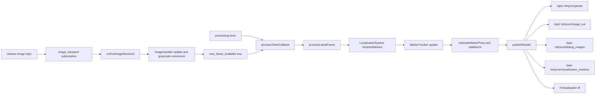
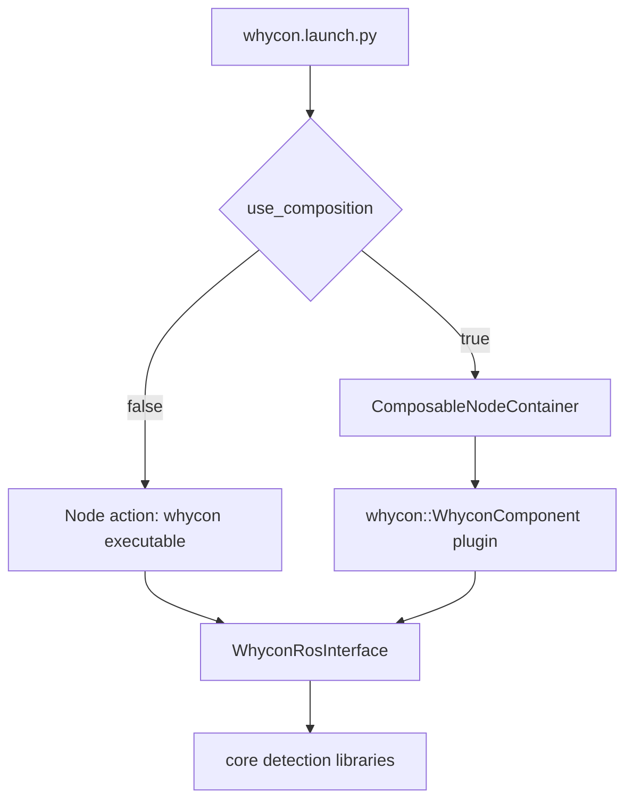
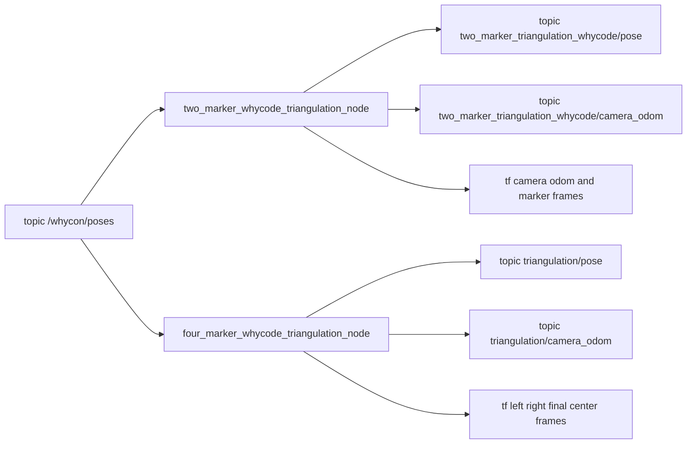

# Architecture

This document describes the internal architecture of `whycode_vision`, including runtime data flow, ROS2 composition, and triangulation integration.

## Runtime Architecture

`whycode_vision` has three major runtime layers:

1. ROS2 interface layer: parameter loading, subscriptions, timers, services, and publications.
2. Core detection layer: image preprocessing, marker detection, WhyCode decoding, tracking, pose estimation.
3. Output layer: pose arrays, debug images, TF, and visualization markers.

## Component and Standalone Modes

The ROS1 nodelet path has been replaced with ROS2 components.

- Standalone executable: `whycon`
- Composable component: `whycon::WhyconComponent`

## Triangulation Architecture

Triangulation nodes are separate ROS2 nodes that consume `/whycon/poses` and publish higher-level camera/marker geometry outputs.

## Ownership by File Group

- `src/ros/*`: ROS2 interface glue, composition support, runtime orchestration.
- `src/image/*`: image memory layout, grayscale conversion, packed binary representation.
- `src/core/*`: candidate detection, WhyCode decoding, pose math.
- `src/tracking/*`: temporal data association and stabilization.
- `src/triangulate/*`: 2-marker and 4-marker geometric triangulation nodes.
- `src/utils/*`: YAML config loading and global config access.

For function-by-function behavior, see [core_algorithms.md](core_algorithms.md).
