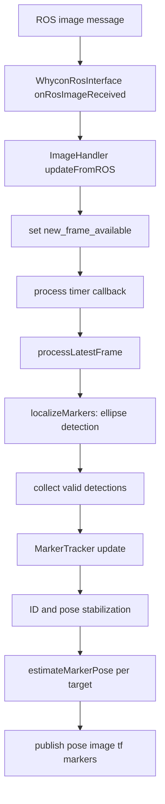
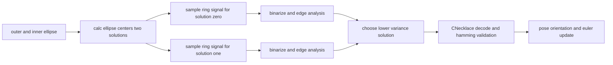
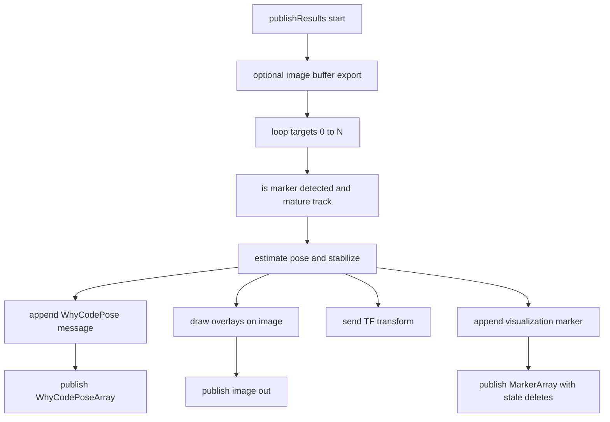

# Detection and Tracking Pipeline

This document details the exact processing flow for one frame in `whycode_vision`, and maps each stage to concrete source files.

## End-to-End Frame Flow

## WhyCode Decode Sub-Flow

## Stage-by-Stage Mapping

| Stage | Main Functions | Files |
|---|---|---|
| Image receive | `onRosImageReceived`, `updateFromROS` | `src/ros/whycon_ros_interface.cpp`, `src/image/image_handler.cpp` |
| Detector pass | `localizeMarkers`, `detectMarkers`, `detectMarkerPair` | `src/core/whycon_localization.cpp`, `src/core/multi_marker_detector.cpp`, `src/core/marker_detector.cpp` |
| WhyCode decode | `processMarkerAmbiguityAndIdentify`, `processSingleSolution`, `selectSolutionAndDecodeID`, `CNecklace::decode` | `src/core/whycon_localization.cpp`, `src/core/CNecklace.cpp` |
| Tracking | `MarkerTracker::update` | `src/tracking/marker_tracker.cpp` |
| Stabilization | `IDStabilizer::stabilize`, `PoseStabilizer::stabilize` | `src/tracking/id_stabilizer.cpp`, `src/tracking/pose_stabilizer.cpp` |
| Publish | `publishResults`, `publishSingleTF`, `createMarkerVisualization` | `src/ros/whycon_ros_interface.cpp` |

## Exact Publish Flow

## Triangulation Flow

- Input for both nodes: `whycode_vision/msg/WhyCodePoseArray` on `/whycon/poses`.
- Two-marker node:
  - Matches configured marker pair.
  - Estimates midpoint frame and orientation.
  - Publishes pose, optional TF, and camera odometry.
- Four-marker node:
  - Computes left-center and right-center intermediate poses.
  - Computes final center from intermediate centers.
  - Publishes intermediate/final TF and camera odometry.

## Determinism Notes

- Processing is driven by a timer with a `new_frame_available` gate.
- Stabilizers make output less noisy but introduce expected temporal smoothing behavior.
- Marker age gates are enforced before publish to reject very young tracks.
